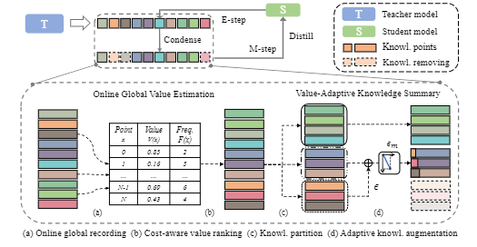

# Knowledge Condensation Distillation (ECCV 2022)([Link](https://arxiv.org/abs/2207.05409))
A Pytorch Implementation of ''Knowledge Condensation Distillation'' (Continuously being organized). 

<div align=center></div>

## Introduction
In this project, we use Ubuntu 16.04.5, Python 3.7, Pytorch 1.9.1 and CUDA 10.2. 

## Running

### Teacher Training

An example of teacher training is:

```
python train_teacher.py --model resnet32x4
```
### Student Training

Fetch the pretrained teacher models by:

```
sh scripts/fetch_pretrained_teachers.sh
```
which will download and save the models to `save/models`

An example of student training is:

```
python super_train_student.py --epochs 240 --path_t ./save/models/resnet32x4_vanilla/ckpt_epoch_240.pth \
--distill kd --model_s resnet8x4 -r 0.1 -a 0.9 -b 0 --trial 1 --warmup 0 --purification 40 --threshold 0.7 --version v3
```

All the commands can be found in folder scripts.

## Citation

If you find this repository useful, please consider citing our paper, thanks.
```
@article{li2022knowledge,
  title={Knowledge Condensation Distillation},
  author={Li, Chenxin and Lin, Mingbao and Ding, Zhiyuan and Lin, Nie and Zhuang, Yihong and Huang, Yue and Ding, Xinghao and Cao, Liujuan},
  journal={arXiv preprint arXiv:2207.05409},
  year={2022}
}
```

## Acknowledgement

Some of our implementation is borrowed from [CRD](https://github.com/HobbitLong/RepDistiller)

